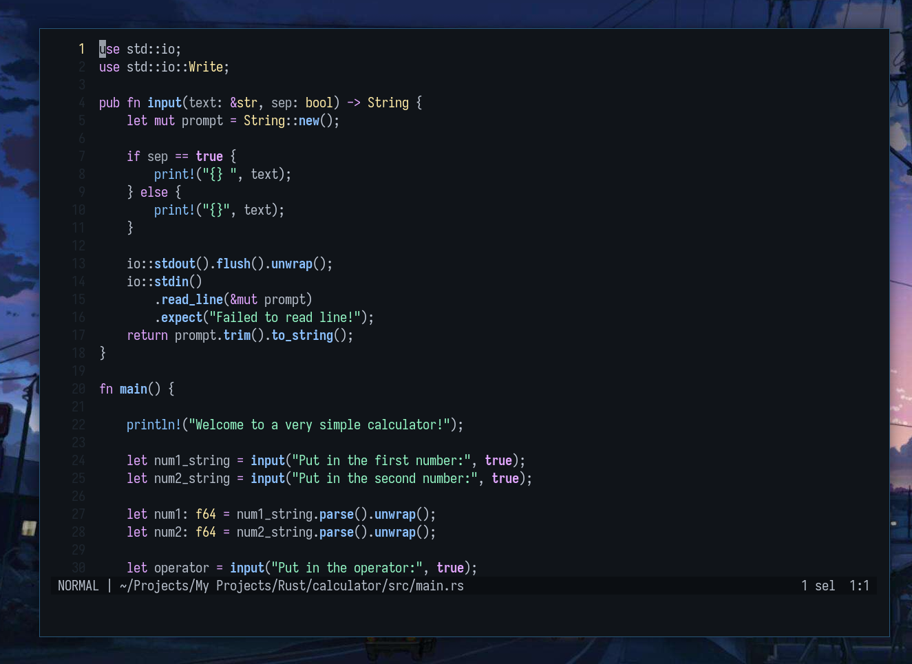

<p align="center">
  
</p>

<h3 align="center">Decay Helix</h3>

# Decay-Helix

Welcome! This is the decay port for Helix!



## Notes

1. For now there is only a dark-decay port, but that will change soon.

## Installation

```sh
git clone https://github.com/decaycs/decay-helix.git
cd decay-helix
cp -r themes/* ~/.config/helix/themes 
# or if you already have a themes directory
cp themes/* ~/.config/helix/themes/
```

### Applying the theme.

Please follow accordingly the next steps.

In your config.toml set this:
```toml
theme = "darkdecay"
```

## Enjoy

We hope you enjoy with decay, please feel free to add a port or something you would want to have
in our organization, you can join our discord to contact us! :)

<a href="https://discord.gg/HaqkpE7B3B">
    
</a>

## Thanks to

- [Alxhr0](https://github.com/Alxhr0)

## Info

If you see any inconsistent when using the theme, please, consider
making an Issue in this repository.
